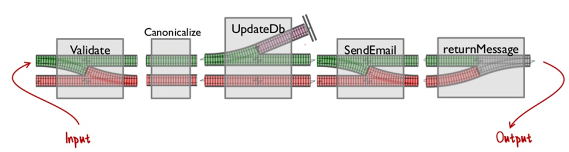
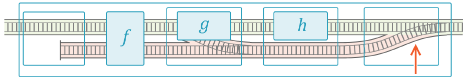
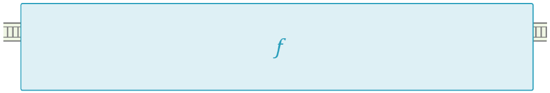

# Functional

The types in this library are borrowed from Functional languages and are to be used anywhere in code to support high-quality design.

## Option\<T>

The `Option<T>` type is a generic type that can be used when a value may or may not exist. it is superior to returning NULL.

The `Option` type can be one of two values: `Some` or `None`

``` csharp
abstract class Option<T> { }

sealed class Some<T> : Option<T>
{
    public T Content { get; }
}

sealed class None<T> : Option<T> { }
```

When a value may or may not exist (whether it's a property, return value, etc...) it should be declare as an `Option` type.

This improves code quality in two distinct ways:
1. It stops developers from conflating the two uses for null.
   1. A value is missing (developer centric, improper)
   2. An object reference is missing (compiler and garbage collector centric, proper)
2. It makes the signature **honest**, ensuring that the compiler will require the developer to consider both cases.

Once a type is made optional the developer must consider both cases in order to have a chance of getting access to the wrapped value.

### Option\<T> Examples

Fetching a user from a database may or may not return a `User` type.
If found the returned type should in fact be a User, but it might not be found.
Thus making the method return `Option<User>` is honest.
The calling code is forced to explcitly check before assuming the result is present.
This removes (or at least greatly reduces) the chance of an unchecked `NullReferenceException`.

``` csharp
// Supplier
class UserRepository
{
    Option<User> TryGetById(int id);
}

// Consumer
var userRecord = userRepository.TryGetById(1234); // Option<User>
if (userRecord is Some<User> user)
    // Work with user
else
    // React appropriately
```

There are also several supporting member and extension methods to make `Option<T>` easier to use.

Some interesting examples include:

``` csharp
Option<T>.Map(Func<T, TNew> map)
// When Option<T> is Some<T> the map is applied and a new Some<TNew> is produced.
// When Option<T> is None<T> the map is ignored and a new None<TNew> is produced.
```

This can be used in conjunction with `Option<T>.Reduce(T whenNone)` to flatten an Option back into a wrapped value:

``` csharp
class UsersController : ControllerBase
{
    [HttpGet("id")]
    public IActionResult GetUserById(int id) => userRepository
        .TryGetById(id)                 // Option<T>
        .Map<User, IActionResult>(Ok)   // Calls Ok(user)
        .Reduce(NotFound);              // Calls NotFound()
}
```

Another example is simply constraining a value based on some predicate.

``` csharp
user = new User();
user.When(u => u.FavoriteColor == Color.Red); // Option<User>
```

This could be used in conjunction with `Flatten` to get a list of users whose favorite color is Red:

``` csharp
IEnumerable<User> weLoveRed = userRepository
    .GetAllUsers()                                                  // [user1, user2, user3, ...]
    .Select(u => u.When(user => user.FavoriteColor == Color.Red))   // [Some(user1), None, Some(user3), ...]
    .Flatten();                                                     // [user1, user3, ...]
```

### Two-track methods (Railway-Oriented Programming)

Having the Option type also eases [Railway-Oriented](https://fsharpforfunandprofit.com/rop/) methods.

With `Option` at our disposal we can design for the unhappy path as well as the happy path.
Working in this two-track mindset again brings honesty to the methods, where not everything goes right.



## Either\<TLeft, TRight>

The `Either` type is similar to Option in that there are exactly two cases.
In the `Option` case there either is a value, or there is not a value.
With `Either` there is always a value, but it's one of two types.

The `Either` type is again used in two-track methods where we make use of the unhappy-path to carry error information.

For example, what happens when you try to sign up for an account using your email address? Is the method signature below honest?

``` csharp
public User CreateUser(string emailAddress);
```

Absolutely not. The happy path works just fine, and is correctly communicated by the method signature.
But what happens when the email address is already in use?
In this case we have an error, but that's opaque to the calling code.
And what happens when there's an error, does it throw an exception? Return null?

When you try to create a new user one of two things happens: **Either** a user is created, or we get an error.
An honest method signature would look more like this:

``` csharp
public Either<Error, User> CreateUser(string emailAddress);
```

Thus it is an honest method signature, and an error occurring is a real possibility that the client code needs to contemplate.

**Convention:** We store the happy path type on the right-hand-side because "right" is synonymous with "correct."
This leaves the left type to be the other case, which is error in this case.

Consuming code would then be forced to deal with both alternatives, alleviating a potential bug:

``` csharp
Either<Error, User> result = service.CreateUser(email);

string message = result
    .Map(newUser => $"Your account for {newUser.Email} has been created")
    .Reduce("This login is already in use.", error => error is UserExists)
    .Reduce("An unknown error occurred.");
```

### Adapters

As with the `Option` type there are several adapters which make working with two tracks easier,
providing methods to reduce back to a single track when the time is right.

Complex methods are decomposed into smaller one or two track methods and recombined at the end, making it transparent to the calling code.

**Implementation**



**Appearance**

